Are you a WordPress user? Do you think it is a good idea to mess with your website which is used by your target customers or visitors? It is definitely not a good practice to do so.

But what if you wanted to make some changes to your website/blog or wanted to play around with different themes and plugins? Wouldn't it be nice to preview the changes, before you modify the actual website or blog?

In order to do that you either need WordPress running on a domain other than your actual WordPress site or on your local machine.

You can develop and test your WordPress website or blog on your local computer without spending a penny. Also, It saves you lot of time along the way.

In this blog post, let us learn how to install and run WordPress on your local computer.

I have divided this entire process into two sections

1. Installing WampServer
1. Installing and running WordPress

## Installing WampServer
### Why Do We Need WampServer?

WordPress runs on web servers that support PHP with version 5.6 or greater, MySQL with version 5.5 or greater and mod_rewrite Apache module. This might change as the WordPress core is updated and you can learn more from the WordPress.org on the requirements.

Now we know, we need a web server that supports PHP and MySQL, in our local computer to run WordPress.

WampServer allows us to create a server type environment from the comfort of our local computer. We can also achieve this setup by installing Xampp. But personally, I prefer Wamp, as it is very easy to use.

### What Is WampServer?

WampServer is a web development platform for Windows machines. It is a software stack consisting Apache, PHP and MySQL. WampServer also includes PHPMyAdmin, an interface that lets you to easily manage MySQL databases via browser.

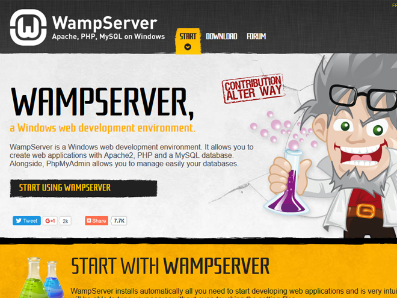

Let us install WampServer and get started with WordPress. At the time of writing this tutorial, WampServer 2.5 is the latest version and it includes PHP 5.5.12 and MySQL 5.6.17.

**Step 01**: WampServer 2.5 requires Microsoft Visual C++ Redistributable to be installed in your 
machine. You can check if Visual C++ Redistributable is already installed by navigating to Control Panel → Programs → Programs and Features. If not, you can download and install Microsoft Visual C++ before installing WampServer.

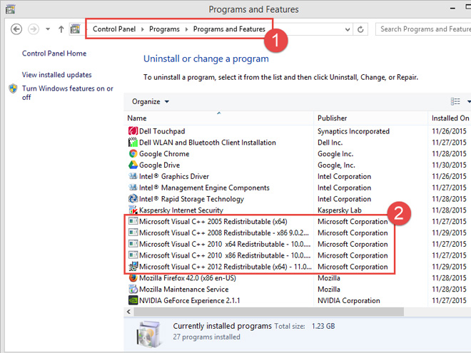

**Step 02**: Download WampServer by visiting http://www.wampserver.com/en/#download-wrapper. You can
 either choose 32-bit or 64-bit WampServer depending on your operating system (OS).

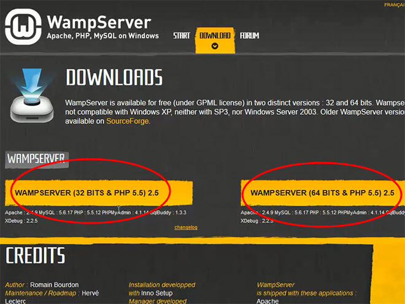

You can check if your Windows machine is running 32-bit or 64-bit navigating to Control Panel → System and Security → System.

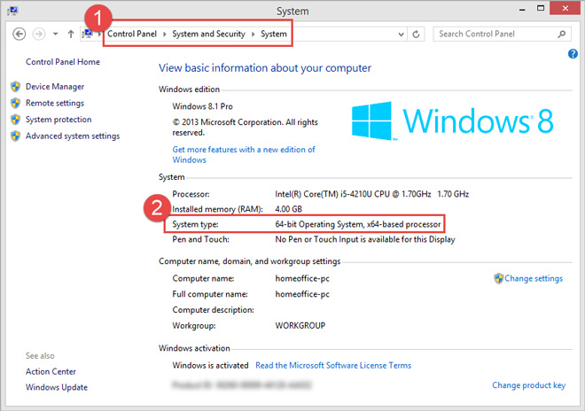

**Step 03**: Run the downloaded installer to install WampServer. WampServer 2.5 is 41.4 MB in size.

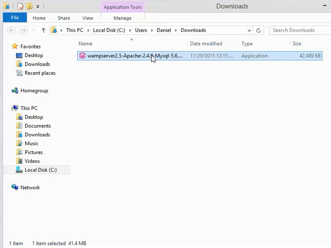

**Step 04**: The setup Wizard opens up with the version details and from here, the steps are self 
explanatory. Click 'Next' to continue.

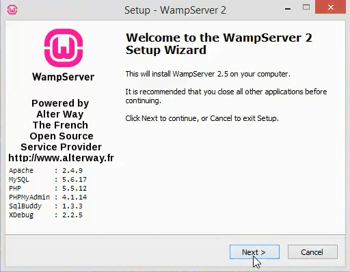

**Step 05**: The next screen shows the License Agreement. You can read through the agreement and 
choose 'I accept the agreement'. Click 'Next' to continue.

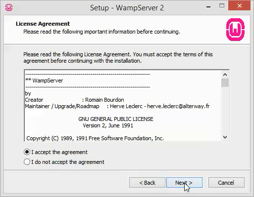

**Step 06**: In this screen, you can select the destination folder to install WampServer. I prefer 
to install it in the default directory. Click 'Next' to continue.

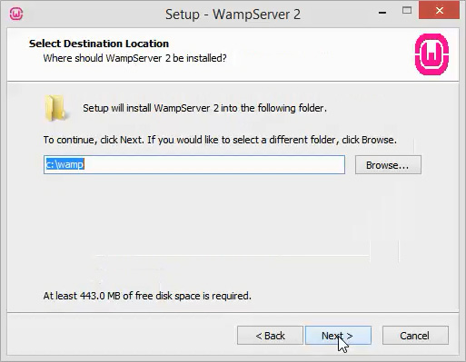

**Step 07**: In 'Select Additional Tasks' screen, you can choose to create Desktop and Quick Launch 
icons and when you are done, click 'Next' to continue.

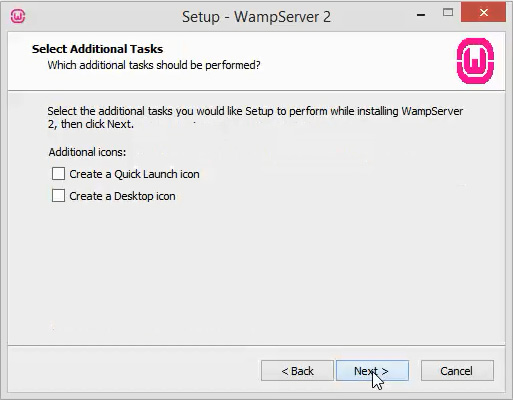

**Step 08**: You can click on 'Install' in the 'Ready to Install' screen.

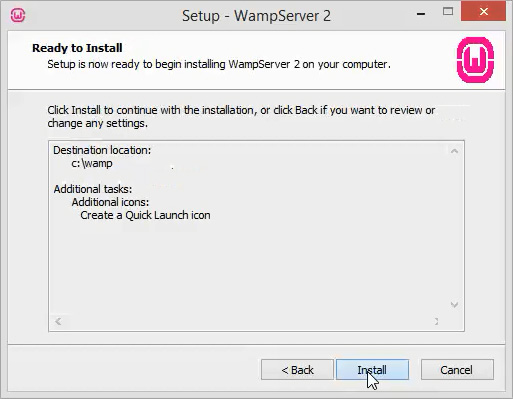

**Step 09**: The installer would ask you to choose your default browser. You can leave it to default
 and click 'Open'.

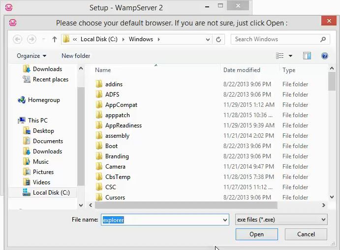

**Step 10**: Leave the values to default in the PHP and mail parameters screen and click 'Next'.

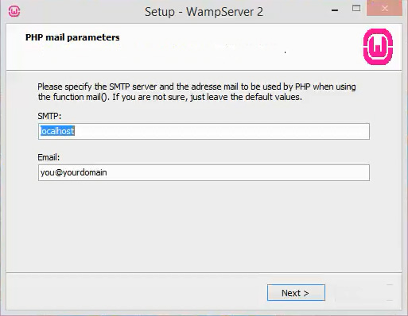

**Step 11**: WampServer might ask you to allow access through Firewall and you must grant access to 
avoid any issues.

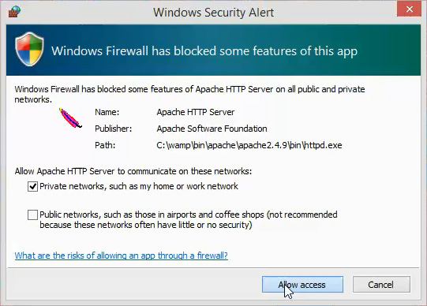

**Step 12**: Check the 'Launch WampServer 2 now' checkbox in the 'Completing the WampServer 2 Setup 
Wizard' screen. Complete the installation by clicking on the 'Finish' button.

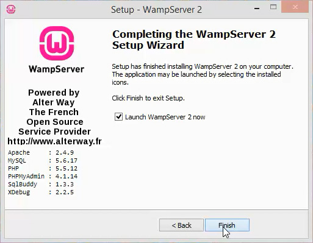

Hooray! WampServer is now installed on your machine and you can observe a new 'W' icon in the taskbar.

### Checking WampServer After Installation

Once we complete WampServer installation, the first thing we need to do is to check if WampServer is installed properly.

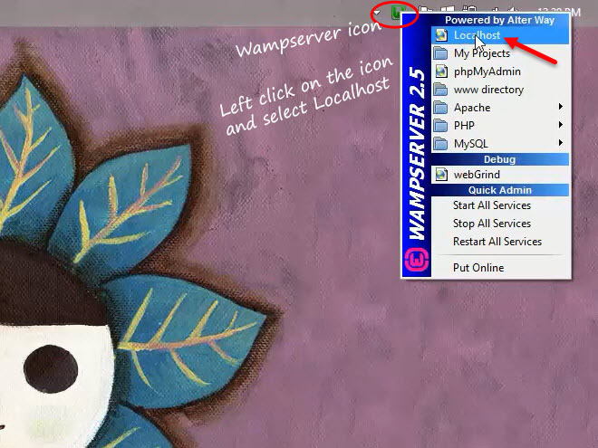

Navigate to http://localhost/ on your favorite browser or left-click on the WampServer icon and choose 'Localhost'. If Wamp functions properly, we should see the Server Configuration page. The Configuration page gives us information on the extensions installed, server version information and few tools for managing the local server.

## Installing And Running WordPress

Let us now get to the interesting part and install WordPress.

### Setting Up Database

**Step 01**: Let us start by setting up a database first. We can use PHPMyAdmin tool to create 
databases.

Navigate to PHPMyAdmin in your browser by typing http://localhost/phpmyadmin. You can also find this tool in the server configuration page under the 'Tools' section. The server configuration page loads up when you type http://localhost/ in your browser.

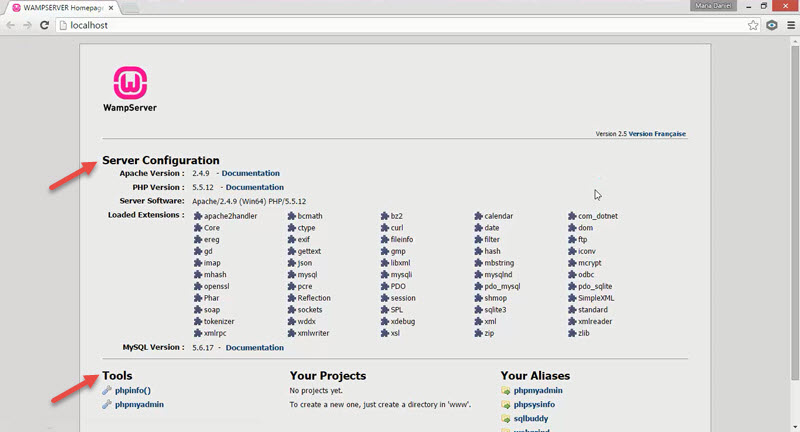

**Step 02**: There are two things that we must consider when creating a MySQL database for WordPress - the database name and the collation.

WordPress and Hackre recommend to use utf8_general_ci collation when creating database for WordPress. Also, WordPress.org recommends to use the same database name as your live WordPress site for your local database. This allows us to easily move the local database to the live server.

For this tutorial, I’m going to create a database with the name 'danielsblog'.

To create a database with the recommended collation, click on 'Database' tab and enter the name of the database. Select utf8_general_ci as the collation and click 'Create'.

Now your database is ready for our local setup.

### Setting Up WordPress

**Step 03**: Head to https://wordpress.org/download/ in your browser and download WordPress. At the time of writing this tutorial, WordPress 4.3.1 was the latest version released.

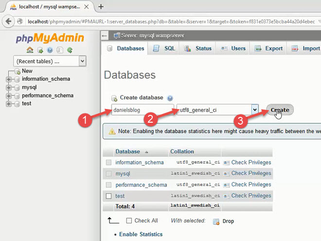

**Step 04**: Extract the downloaded file to 'www' folder found inside the directory where you 
installed WampServer. I had installed Wamp in the default directory and my 'www' folder would be found in 'C:\wamp\' directory.

You can rename the extracted folder to 'yoursitename'. This way you can keep it organized and can run multiple local sites without confusion. I have renamed to 'danielsblog'.

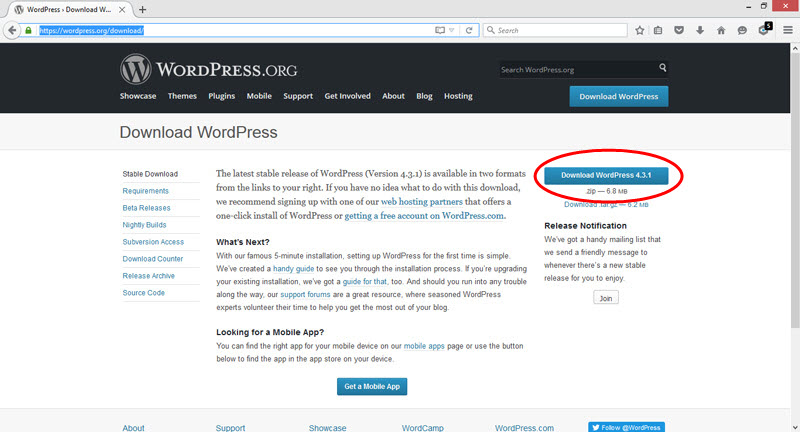

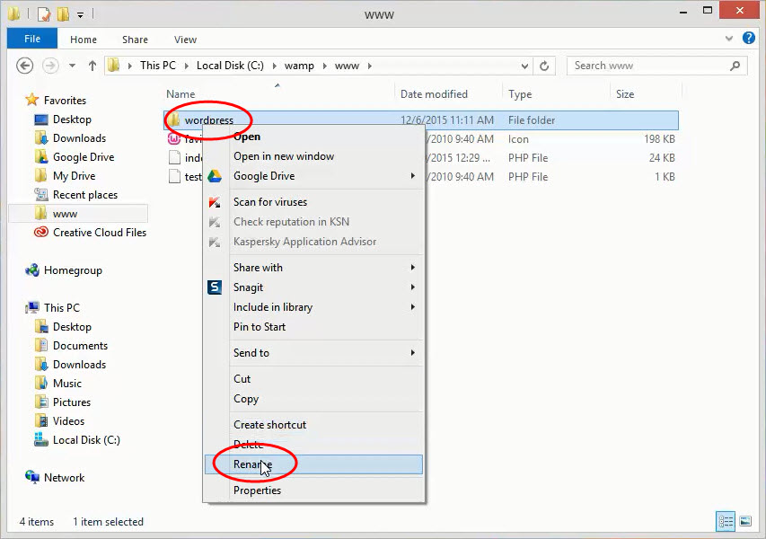

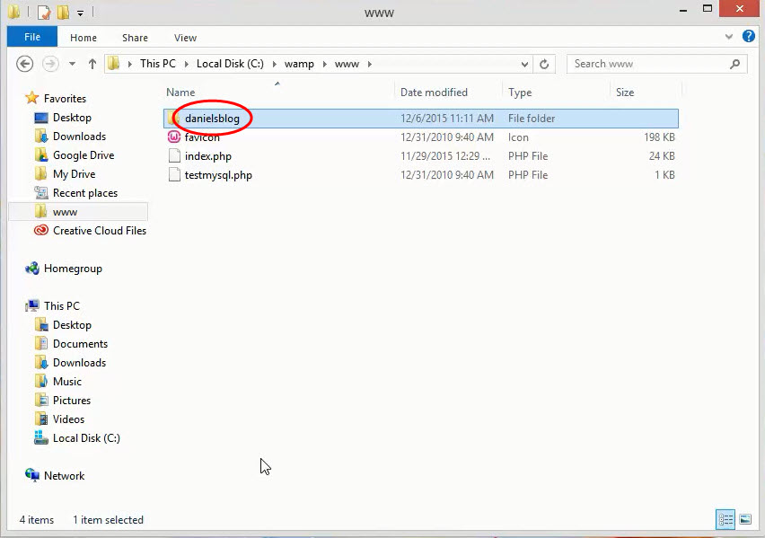

**Step 05**: Open up your browser and type http://localhost/yoursitename. Now you should see a page asking to select the language. Select your preferred language and click 'Continue'. I prefer to use English (United States).

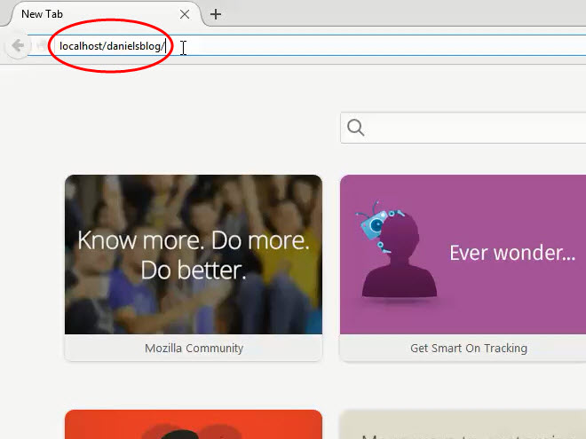

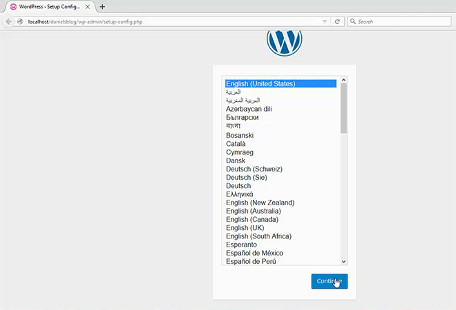

**Step 06**: In the next screen, WordPress prompts you to get the following information.

- Database name
- Username
- Password
- Database host

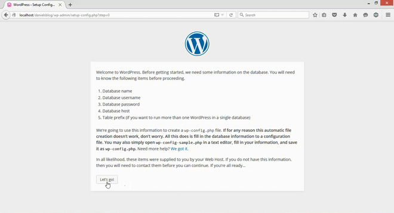

**Database name** - If you remember, we created the database using PHPMyAdmin by providing a database name. Enter the same database name while creating the Configuration file. I have created a database with the name 'danielsblog'.

**Username, Password and Host** - MySQL ships with the default root account. 'root' is the 
username and there is no password set for this account. The database host for this account is 'localhost'. You can check this by navigating to http://localhost/phpmyadmin/ in your browser and click on 'mysql' database in the left pane. Clicking on the 'user' table will list all the users in the table.

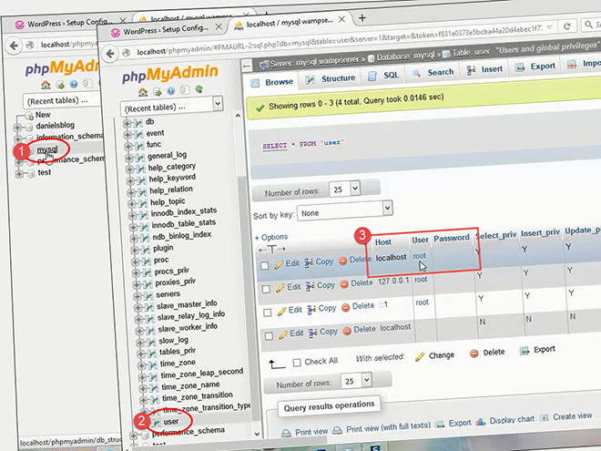

Now that you have all the information, click 'Let’s go' to continue in the WordPress setup screen.

**Step 07**: You will be asked to enter the database information in the following screen.

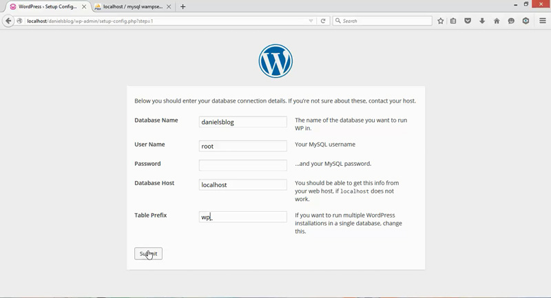

It is a best practice to change the default WordPress table prefix to avoid brute force attacks. Similar to database name, you can use the table prefix values from your live WordPress site. This makes the process easier when you move the local database to your live server. If you prefer to leave it to default, then click 'Submit'.

WordPress creates a configuration file called wp-config.php in the root folder and saves these information in it.

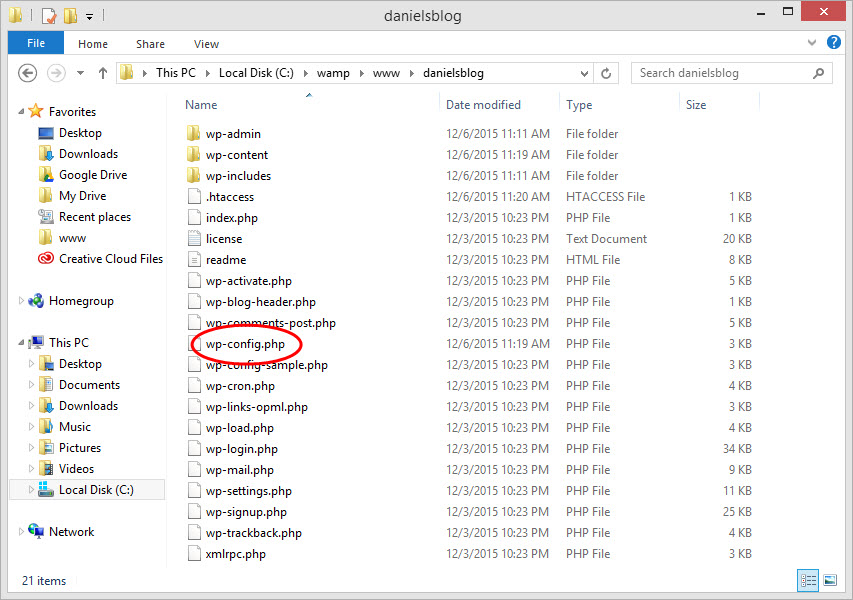

**Step 08**: In the next screen, you should get the following message.

All right, sparky! You’ve made it through this part of the installation. WordPress can communicate with your database. If you are ready, time now to…

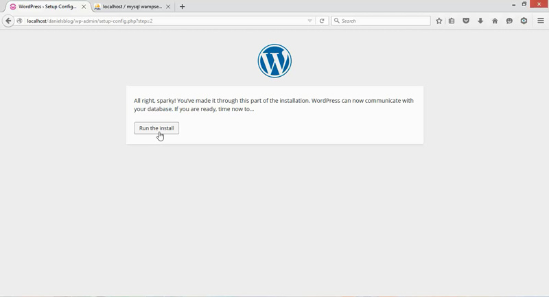

Click on 'Run the install' and you will be taken to the Welcome screen.

**Step 09**: In the Welcome screen, WordPress will ask you for the following information.

- Site Title
- Username
- Password
- Email
- Privacy

Enter the above information and you can uncheck 'Allow search engines to index this site' checkbox as this is a local website. Click on 'Install WordPress' to complete WordPress installation.

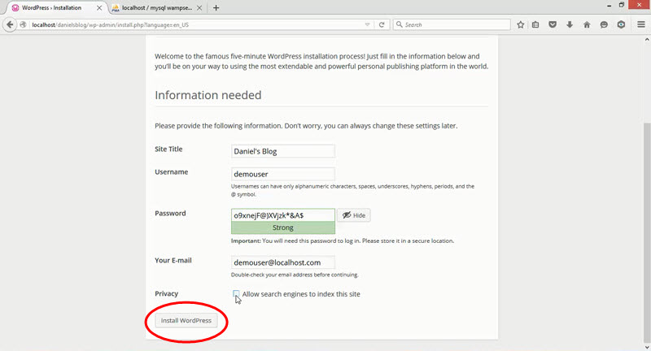

Upon successful installation, you will be taken to the 'Success' screen.

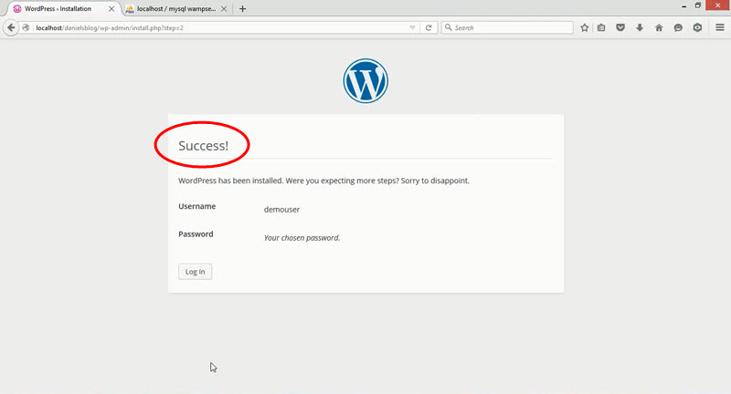

Congratulations, your local WordPress website is now ready. You can login and start playing around.

How does a local WordPress setup improve your workflow? Please do let know me know in the comments.
