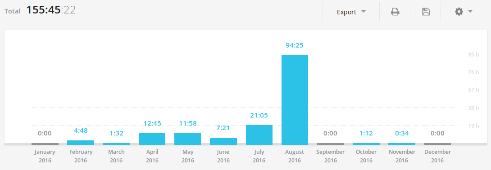

This is the first time in my life, I'm taking time to sit down and reflect on the course that I 
traversed over the past 52 weeks. I'm writing this year end review to keep me accountable as I 
had bid goodbye to [my steady job](/blog/adieu-infosys/) to pursue my interest in developing 
WordPress and web applications.

I started the year 2016 with a major focus on the following areas.

- Blogging
- Attending a tech conference
- Learning WordPress
- Travel
- Reading

## Blogging

I launched this blog with a typical [Hello World](/blog/hello-world) post on January 1, 2016. I 
have been writing blogs even before 2016, but I was never serious about it.

Starting 2016, I wanted to blog consistently. I had initially planned to write one post per week. Looking at the numbers, I had written only 13 posts all together in the year 2016.

Though I did not hit my mark, I'm happy that I started this blog. By the way, the Hello World 
post idea was inspired from [Sudar's blog](http://sudarmuthu.com/blog/hello-world/).

## Attending A Tech Conference

I have never been to any technical conference before 2016. This was in my to do list for a long time.

Early 2016, I've been put up, to work on Oracle PL/SQL project in my full time job and that 
pushed me to find a conference around the Oracle PL/SQL subject. I assumed that attending a 
conference could help me speed up my learning process and of course, it did. Eventually, I 
discovered [OTN Yathra](https://www.facebook.com/otn.yathra), a conference conducted by Oracle ACE folks to share the knowledge on Oracle products. I even wrote a [blog post](/blog/otn-yathra-2016-experience-takeaways/) sharing my experiences and takeaways.

## Learning WordPress

Building web applications is something that I enjoy doing and my interest grew multiple times, when I discovered WordPress, a few years ago. Learning to develop WordPress powered websites/applications was very challenging to me at that time. But the desire to do has been lingering within me, since then. So in 2016, I made up my mind to learn WordPress, no matter what.

I soon realized that I can learn WordPress quickly by contributing to open source WordPress 
projects. I began my contributions by sending the [first pull request](/blog/first-pull-request/)
 to the [Easy Retweet](https://github.com/sudar/easy-retweet) WordPress plugin.

Later, I contributed to [Email Log](https://github.com/sudar/email-log), a WordPress plugin that 
logs the emails sent. [Sudar](https://twitter.com/sudarmuthu), the plugin author was kind to 
mention about my contributions in his [blog](http://sudarmuthu.com/blog/email-log-wordpress-plugin-v1-9-released/).

I then, took part in the Hacktoberfest challenge by contributing to Yapapaya's [Live Comment 
Preview](https://github.com/Yapapaya/live-comment-preview/commits?author=mariadanieldeepak) 
plugin and completed the challenge. Yapapaya was kind to share about my contributions in [their Hacktoberfest story](https://yapapaya.com/2016/11/04/little-hacktoberfest-story/).

On the whole, I had spent about 155 hours in 2016 on learning/contributing to open source WordPress projects.

Eventually, these contributions paved my way to land a [full time job]
(/blog/new-job-anatta-design/) as a WordPress developer.

## Travel

In the beginning of 2016, I had planned to travel to at least one destination that I have never been to.

I flew to Goa with my buddies in the month of March. Not only this was my first flight but also it was one of the best trips in my life. On the whole, the trip was totally refreshing, adventurous and exciting.

If you plan to visit Goa, don't miss out - Parasliding, Parasailing and Water Scooter riding.

## Reading

I wanted to pick up the habit of reading books. Well, a year passed by and I found that [I did 
not make much progress](https://www.goodreads.com/user/year_in_books/2016/55377048) in reading in 2016.

2016 was a year of changes in my life and I'm very happy about what I did in the past 52 weeks.

In 2017 my focus would be on the following areas.

- Becoming a better WordPress developer
- Blogging
- Reading

How was your 2016? I'm interested to know what have you planned to focus on in 2017. Please share it in the comments section below.