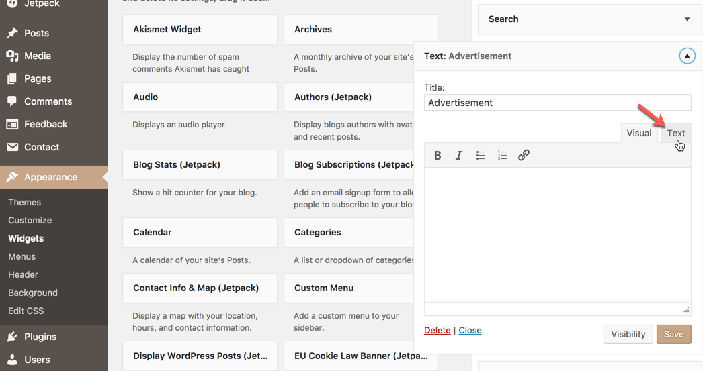
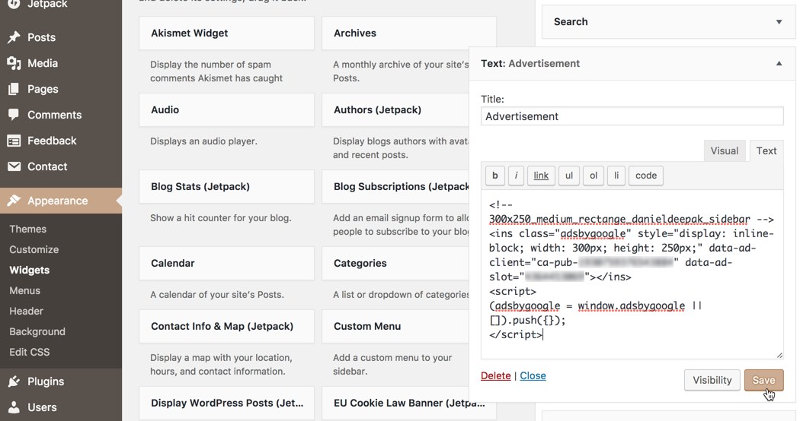
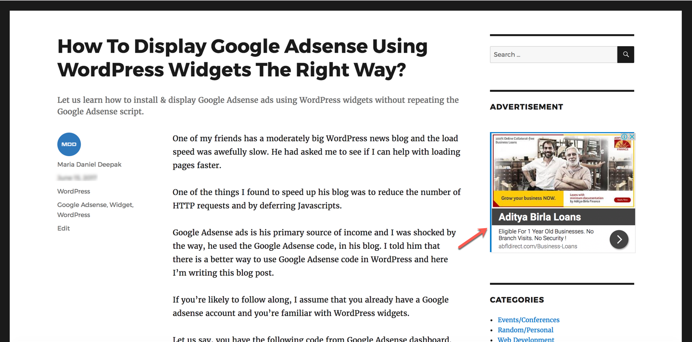

One of my friends has a moderately big WordPress news blog and the load speed was awefully slow. He had asked me to see if I can help with loading pages faster.

One of the things I found to speed up his blog was to reduce the number of HTTP requests and by deferring Javascripts.

Google Adsense ads is his primary source of income and I was shocked by the way, he used the Google Adsense code, in his blog. I told him that there is a better way to use Google Adsense code in WordPress and here I'm writing this blog post.

If you're likely to follow along, I assume that you already have a Google adsense account and you're familiar with WordPress widgets.

Let us say, you have the following code from Google Adsense dashboard.

~~~js

<!-- 300x250_sidebar -->
<ins class="adsbygoogle"
     style="display:inline-block;width:300px;height:250px"
     data-ad-client="ca-pub-1XXXXXXXXXXXXXXX"
     data-ad-slot="4XXXXXXXXX"></ins>

~~~

[GitHub gist](https://gist.github.com/mariadanieldeepak/1bad3d8266b05ae4cf25835874d94c2b)

The `adsbygoogle.js` is a common Javascript file that is required on all the pages where you want to display the ads. So this should be made to load only once on the web page.

~~~

~~~

[GitHub gist](https://gist.github.com/mariadanieldeepak/67f7ff0fd4ed833f8d02acbd8d795410)

Rather than using the `
~~~

[GitHub gist](https://gist.github.com/mariadanieldeepak/de4cf4dd9b8884fce6a9966664a7c2c2)

Tada! We have set up everything for our Adsense script to start serving ads. In addition to this,
 we could defer loading the script, so that we can avoid the ‘Render blocking Javascript’ issue. Google has developed an online tool - [Google PageSpeed Insights](https://developers.google.com/speed/pagespeed/insights/) that will help you identify other such issues in your website.

~~~php
function add_async_attribute( $tag, $handle ) {
	if ( 'my-google-adsense-js' !== $handle) {
		return $tag;
	} else {
		return str_replace(' src', ' async="async" src', $tag);
	}
}

apply_filters( 'script_loader_tag', 'add_async_attribute' );
~~~

[GitHub gist](https://gist.github.com/mariadanieldeepak/01d63ba2e5ab48b45029119feaa98d80)

Learn more about the differences between "defer" and "async" attributes [here](http://www.growingwiththeweb.com/2014/02/async-vs-defer-attributes.html).
