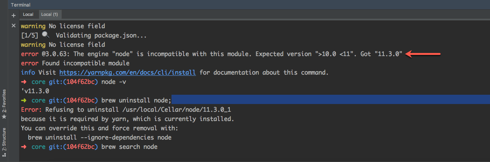

At my day job, we run Docker to set up our development environment. However at times, there are some glitches and at one such time, Docker let me down. I had to set up an alternative to continue my work.

I chose to use MAMP. However I needed to downgrade Node to install and use all my dependencies. So here is what I did.

~~~bash
# Find existing version
node --version

# Search available Node versions.
brew search node

# I neeeded a version between > 10.0 < 11. So I chose node@10.
brew install node@10

# You can install multiple versions, but you cannot have them available all at once.
# Hence unlink the generic version.
brew unlink node

# Link the version that you just installed.
brew link node@10

# For some older node versions (which are keg-only), it might be required to link them 
# with the --force and --overwrite options
brew link --force --overwrite node@10

# Find downgraded version
node --version
~~~

[GitHub Gist](https://gist.github.com/mariadanieldeepak/9fe3d4cfc49f0e0ce0c5da1a8239f59e)