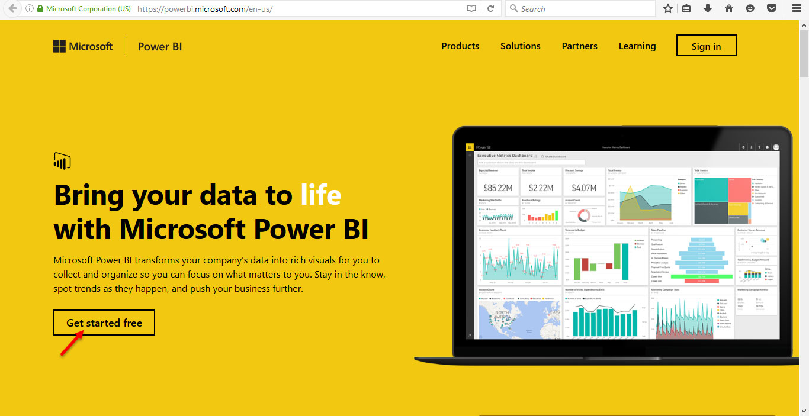
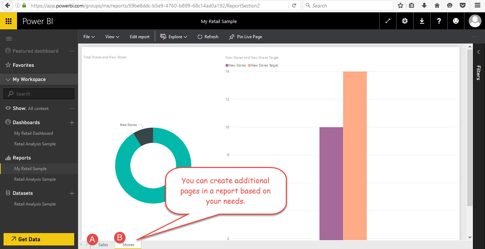

This post is a part of the series called Microsoft-in-campus session on Power BI.

- [Microsoft-in-campus Session On Power BI – Sharing My Insights](/blog/msft-powerbi-session-introduction/)
- [Microsoft-in-campus Session On Power BI [Part 1]](/blog/msft-power-bi-session-part-1/)
- [Microsoft-in-campus Session On Power BI [Part 2]](/blog/msft-power-bi-session-part-2/)
- Microsoft-in-campus Session On Power BI [Part 3]
- Microsoft-in-campus Session On Power BI [Part 4]

In this session, the speaker enlightened on the following.

- Power BI building blocks- Datasets, Reports and Dashboards
- Hierarchy between Datasets, Reports and Dashboards
- Creating a sample report
- How to save a report?

## Power BI Building Blocks

Power BI has three building blocks namely the _dataset_, _report_ and _dashboard_. You can understand the hierachy between these building blocks from the following definitions.

A **dataset** represents a single source of data that you connect or import into Power BI. Dataset 
holds the information of the data source and the information required to connect, like credentials. A dataset once created can be used in multiple reports.

A **report** in Power BI is intended to represent data using visualization such as charts and graphs
. In order to create a report, data is required. We can import or connect to data using datasets.

Reports can be manually created by using datasets. Or, Power BI automatically creates reports for you when you connect to online services (through service content packs). Power BI desktop lets you create reports by combining different data sources.

> Content pack is a simple way to organize and package datasets, reports and dashboards together 
into a single entity.

Learn more about Content packs in [part 2 of this series](/blog/msft-power-bi-session-part-2/).

**Dashboard** is a way to organize and present insightful reports in one place. A dashboard is 
canvas on which you can pin with _tiles_ and _widgets_. Each tile is a visualization from a report.

> Widgets are special types of tiles with which you add entity like text, images, etc that are not
 part of the report.

Learn more about [Datasets, Reports and Dashboards](https://powerbi.microsoft.com/en-us/documentation/powerbi-service-basic-concepts/).

## How To Create A Report?

Creating a report involves the following.

1. Signing up for Power BI (assuming you don't have a Power BI account)
1. Connecting to a data source
1. Creating a simple report

**Sign up for Power BI**: You can easily sign up for Power BI by heading to [PowerBI.com](http://powerbi.com/). All you 
need is an Organization email address to get started with Power BI. Email address from email service providers like Gmail, Yahoo, Outlook, etc. cannot be used to create an account with PowerBI.com.

**Connect to data source**: In order to create a report, we need data. The speaker used the data 
from the samples provided by PowerBI and I'll be using the same. If you wish to follow along, you
 can find the samples in the _Welcome screen_. We will be using the _Retail Analysis sample_. You 
 can learn more about the sample [here](https://powerbi.microsoft.com/en-us/documentation/powerbi-sample-retail-analysis-take-a-tour/).

**Create a simple report**: The Retail Analysis sample is a content pack that contains the 
_dataset_, _report_ and _dashboard_. _You need to understand the data_ to create reports and to 
draw insights with your data.

The Retail Analysis sample focuses on sales data and compares metrics such as sales, new stores, margin, etc. between the current year and the previous last year.

Let us create a couple of reports and pin a few on to a dashboard.

**Step 01**: Click on the dataset using which you want to create a report.

**Step 02**: You will see a blank canvas with _Visualizations_ and _Fields_ windows on the right 
sidebar.

**Step 03**: We shall create a simple table report to _compare total units_ sold last year and this 
year _each month_ during the fiscal year. In order to do that, drag and drop the `Fiscal Month` 
field from the `Time` sheet on to the blank white canvas. By default, PowerBI creates a _table 
visualization_ when you drag and drop a column from the _Fields_ window.

**Step 04**: Drag and drop `Total Units Last Year` and `Total Units This Year` columns over the table 
report created earlier. PowerBI automatically udpates the values based on the `Fiscal Month` that
 you placed on the canvas earlier. The _Visualization_ windows lets you to gain more control and 
 allows you to change and format the visualizations.

**Step 05**: You can save the report by click on the `Save` button. Once you save the report, you can 
find it under the Reports section. The _yellow asterisk_ indicates that you have created the 
report recently. This behaviour is applicable for _datasets_ and _dashboards_.

I have created an additional report page and few other visualizations other than the table visualization.

**Step 06**: Now, let us pin the report the to a dashboard.

To pin a visualization to a dashboard, hover over any visualization and you will find the 'pin' 
icon. Click on the _pin icon_ and you can pin it to either a _new_ or an _existing_ dashboard. 
That's it. This way you can pin visualizations that are in the similar context to present data in a meaningful way.

We now have successfully created a report, learnt how to pin reports to a dashboard and also learnt to save reports.

The speaker also demonstrated how to create reports in Power BI Desktop and upload it to the 
Power BI service. You can learn more about that from the [Power BI documentation portal](https://powerbi.microsoft.com/en-us/documentation/powerbi-desktop-getting-started/#shape-and-combine-data). 