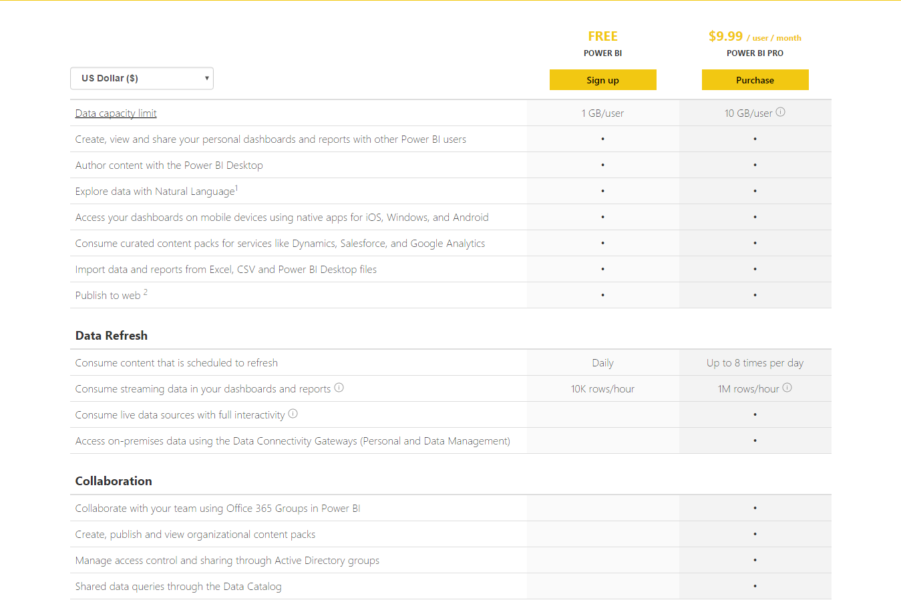

This post is a part of the series called Microsoft-in-campus session on Power BI.

1. [Microsoft-in-campus Session On Power BI – Sharing My Insights](/blog/msft-powerbi-session-introduction/)
1. Microsoft-in-campus Session On Power BI [Part 1]
1. [Microsoft-in-campus Session On Power BI [Part 2]](/blog/msft-power-bi-session-part-2/)
1. [Microsoft-in-campus Session On Power BI [Part 3]](/blog/microsoft-campus-session-power-bi-part-3/)
1. Microsoft-in-campus Session On Power BI [Part 4]

## What Is Power BI?

Power BI is a cloud based SSBI(self-service business intelligence) tool. You heard that. It's cloud based and all you need to use Power BI is just a browser.

With Power BI you can analyze and visualize data. You can collaborate with your team, create 
reports and share the reports with intended people. Visit [PowerBI.com](https://powerbi.microsoft.com/en-us/) and get your hands on the Microsoft's SSBI tool right away.

## History Of Power BI

Until 2015, Microsoft as part of Business Intelligence, was focusing more on Power Query, Power Pivot, and Power View and MSBI tools. Though these tools were powerful, yet it required the involvement of IT developers to come up with a report or analysis.

Starting from early 2015, Microsoft started to shift its focus towards SSBI. This is where Power BI plays an important role. Power BI is not just intended for BI developers. Anyone with data wanting some insights can use Power BI. It's easier to analyze and visualize data with Power BI. This tool leverages HTML 5 to render visualizations in browser.

## How Do You Use Power BI?

There are two ways to use Power BI.

1. Power BI Service (PowerBI.com)
1. Power BI Desktop

## What Is Power BI Service?

As mentioned earlier, Power BI can be accessed via PowerBI.com and this cloud SaaS is called the Power BI service. To access the cloud service, you require a modern web browser and a work email address. You cannot sign up for Power BI using emails from free service providers like Gmail, Yahoo or Outlook. No other special hardware or software is required.

## What is Power BI Desktop?

Power BI Desktop is a free application that works in conjunction with the Power BI Service. Power BI Desktop allows you to do the following.

- Get the data from variety of sources
- Create relationships between your data and enrich your data model
- Create and save your reports
- Upload or publish your reports

The reports created using Power BI Desktop can be published to Power BI Service right from the Power BI Desktop application. Both Power BI Service and Power BI Desktop are free.

Power BI, in terms of pricing model, is categorized as

- Power BI (Free)
- Power BI Pro

You can upgrade to pro version by purchasing the license.

## How Power BI Pro Differs From The Free Power BI Service?

Power BI Pro allows you to consume live data sources, on premise data and allows to collaborate with team using Office 365 groups. With the free Power BI Service and the Power BI Desktop, you can only analyze and visualize data but cannot share or collaborate with your team.

The below image shows the comparison between Power BI and Power BI Pro.

Learn more about [Power BI vs. Power BI pro](https://powerbi.microsoft.com/en-us/pricing/).

## How Much Does Power BI Cost?

Power BI and Power BI Desktop versions are free. The [Power BI Pro](https://powerbi.microsoft.com/en-us/pricing/) version costs $9
.99/user/month (600 INR/user/month)

## Power BI And On-Premise Data

This Microsoft-in-campus session was intended to encourage the Organization to use Power BI and the speaker focused on how the Organization can connect with on premise data to analyze and visualize data.

Power BI is not available as an internal product or as an internal service. However, by using Power BI service, Organizations can collaborate and share reports using the on premise data.

Power BI can be connected to variety of data sources including files and databases. It can also directly connect to third party applications such as Salesforce, Mail Chimp, Google Analytics, etc. using the built-in connectors.

The speaker concluded the first session with these topics.