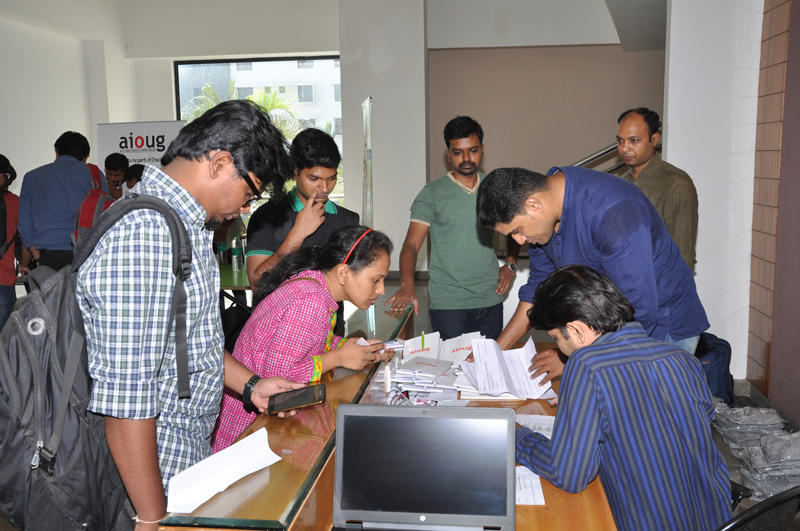
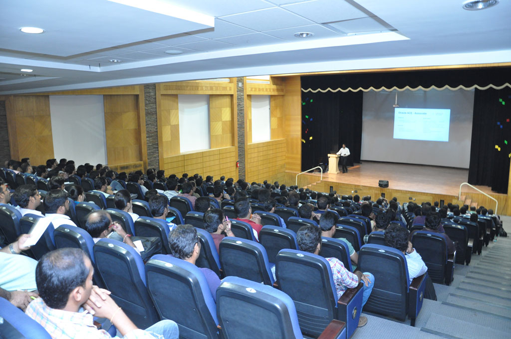
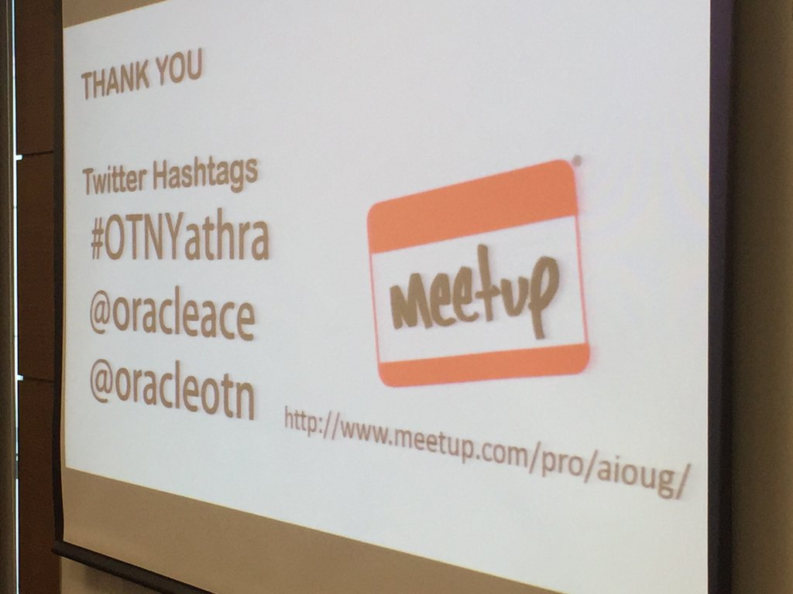
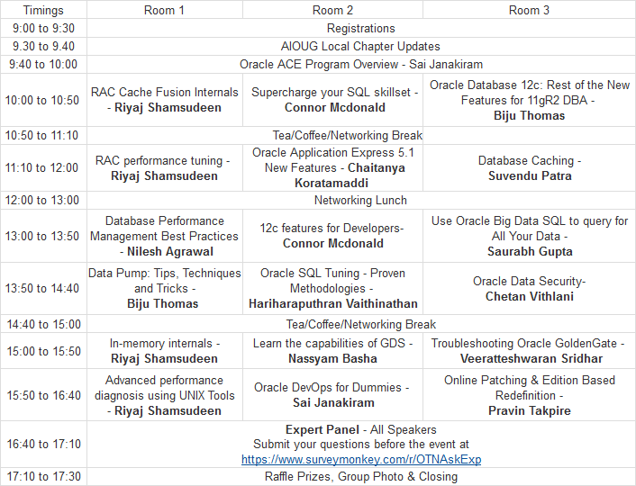
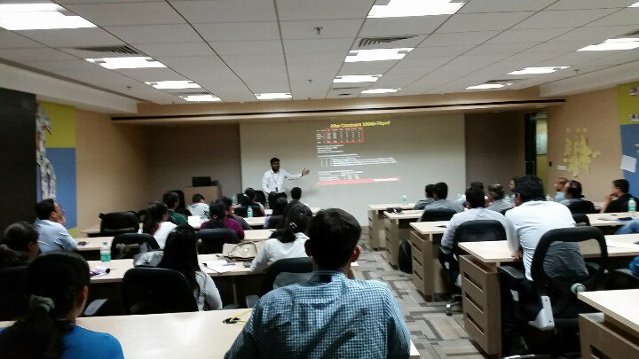
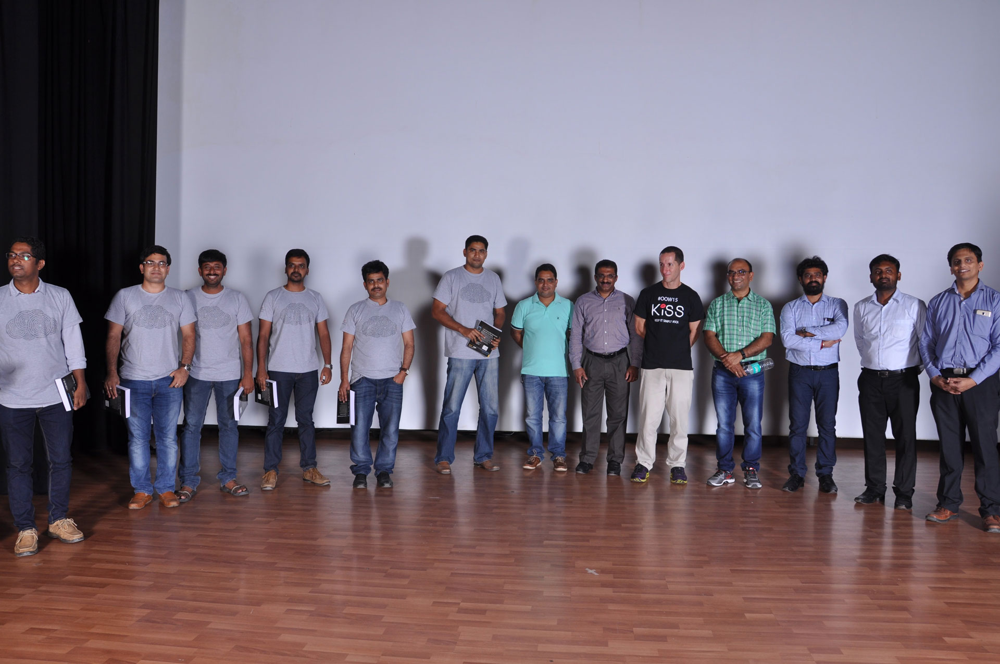
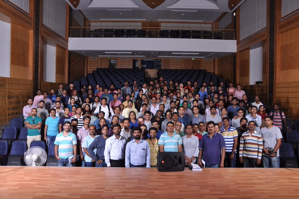

**Disclaimer**: The opinions expressed here are my own.

One of the goals I had set for 2016 is to attend at least one event/conference before the year 
ends. I’m glad that I accomplished it by attending the [OTN Yathra 2016 conference](http://otnyathra.com/index.php?option=com_content&view=article&id=71:bangalore&catid=19&Itemid=260) on April 24, 2016.

Before attending the OTN Yathra conference, I had neither an idea on what was it all about nor what to expect. So I’m writing this post with the intention to shed some light for people like you who are curious to know about OTN Yathra.

## My Experience

**What is OTN Yathra?** - OTN Yathra is a conference organized by Oracle ACE directors and 
volunteers across India in six major cities (Chennai, Bangalore, Hyderabad, Pune, Mumbai and Noida). The main focus of the conference is to unite the Oracle community members to raise awareness on happenings around the Oracle world and to build network amongst the community members.

Technical conferences/events are one of the easiest ways to keep yourself up to date on a technology and also a way to meet and network with new people within that community.

**How did I hear about OTN Yathra and does it cost to register?** - I was keen on finding a 
conference/event on Oracle database technology. Eventually I ended up finding OTN Yathra through social media. OTN Yathra is a one-day conference and the registration to the conference costs 700 INR which includes lunch. Note that the early bird registration costs only 500 INR including the lunch.

**How did I spend the day?** The day of the conference had arrived and I showed up half an hour 
prior to the actual start time. As soon as I hit the welcome desk, one of the members asked if I can volunteer with souvenir distribution for registered members. I was more than happy to help and I volunteered.

I started to introduce myself to two other volunteers. I usually shy away from speaking to strangers but I opened up the conversation on that day. After all, the purpose of these conferences is to network with people within the community.

The conference was scheduled to start by 9.00 AM. The conference began with the introduction session and the organizers presented about the what OTN Yathra was all about and also about the Oracle ACE program. As soon as the one of the organizers talked about the ACE program he acquired the attention of the attendees. Because most people hardly knew about the ACE program.

By the end of the introduction session, the organizers promised goodies for the attendee who tweets more with the hashtag #OTNYathra.

The agenda for the conference has been shared in OTN Yathra’s website beforehand. The attendees can pick up sessions of their choice from the agenda. All of the attendees were hoping to learn, new and interesting stuffs.

As you can see from the agenda, the sessions were interesting and I couldn't wait any longer to 
hear from the speakers. As a first-timer, I felt that the sessions were very insightful and 
motivational. I believe that most people would have felt the same. The sessions I most enjoyed 
were the ones presented by [Connor McDonnald](https://twitter.com/connor_mc_d), [Hariharaputhran]
(https://twitter.com/puthranv), [Sai Penumuru](https://twitter.com/sai_penumuru) and [Chaitanya](https://twitter.com/chaitanya_in).

**Are the sessions suitable for everyone?** The sessions were focused more on the intermediate to 
advanced level Oracle users.

**Breaktime & Lunch** - During the breaks, I happened to speak to two speakers and it was really 
amazing to listen to their stories. Snacks and lunch were provided during the breaks and I must admit that the lunch was good.

Around 5 PM, all sessions were completed and all the attendees gathered for the closing ceremony. The interesting part was when all the speakers were invited to the dais and the attendees were allowed to ask questions.

**Surprise goodies!** - Finally, to my surprise, the organizers called out all the volunteers and thanked by rewarding them with a book. I was excited to receive the book. The closing ceremony came to end an after the entire group was photographed.

**A big thanks to the Organizers** - Organizing a conference is no easy task. I really appreciate Sai Janakiram and his team for organizing the OTN Yathra 2016 conference.

> I would say - OTN Yathra is a journey destined to learn, share and to spread the love for Oracle.

**Things that put me off** - During the introduction session, the organizers promised goodies to the attendees who send highest number of tweets with hashtag - #OTNYathra. It was very disappointing to see that they didn’t have any mechanism/tool to count the tweets sent with the announced hashtag.

## Takeaways from OTN Yathra

If you are attending conferences only to learn without networking with folks around, you're missing ton of opportunities. I'll share a few tips that I picked up along the way which might help you to get maximum value from the conferences you attend.

**Prepare your questions prior to the conference**. I learnt that preparing insightful questions prior to day of the conference can help you get answers from experts and also makes you to stand out in the eyes of the speakers. This could lead to an interning or business opportunity.

**Don’t forget to take your calling card**. Don’t expect every person you meet to have an account in the favorite social media of your choice. Having a calling card (good ol’ traditional way) provides an easy way for you and the other person to stay connected after the conference. Most people I met didn’t have a Twitter account. Thankfully, all of the speakers had theirs and I was able to connect with them.

**Choose people to network with**. It is hard to meet and make friends with all people you see in the conference. Most conferences will have a meet up page (OTN Yathra has one) or a similar way to explore the attendees and the speakers. Learning to identify and choosing people to network with, benefits you and the person you connect to. At the least, you will refrain yourself from people who may not want to befriend with you.

**Ditch the internet and carry the agenda**. Lots of people, due to lack of internet connection, were enquiring others about the agenda. Jotting the agenda down or taking a snap of the agenda will be handy during the conference.

**Do follow up on what was promised**. Sometimes, the organizers/speakers might forget what they had promised you on the day of the conference. For example, you might have been promised to receive slides or links to the articles. Don’t wait up for days, to receive what has been promised. Instead, do follow up with the organizers/speakers. This way you don’t miss any good stuff.

**Digital recorder might be handy**. Carrying your digital recorder might save your day. You can 
record the sessions and listen to them at your convenience. This might be handy if you’re unable 
to follow speakers who speak fast and also saves you from losing important stuffs that you might have missed to note. I would recommend you to buy Zoom H2n recorder if you don't own one ([Amazon US](http://amzn.to/24Cnejw) sells it cheaper that the [Indian store](http://amzn.to/24Co53O)).

What are your takeaways from the conferences that you attended? Please do let me know in the comments.

**IMAGE CREDITS**

- [Flickr](https://www.flickr.com/photos/theo_reth/2829011392/in/photolist-5iZqwu-qUBUdL-9JjZYY
-midg8z-dCgCgL-kZjzHr-i8vRmc-iJxyt2-fc3yYU-7KPfsc-rcXPkV-aD51do-8D5uRZ-dWEAfe-E1c6M-oezSk4-dC7mdN-dCqduA-oWQEiZ-gfJNHC-enczFG-dD5iLr-nU774o-6y9Es2-nziqzC-FQq5rc-gNc1wX-FNPhV-qqc7uA-47V69P-hPQPTq-nqCoYj-c2RGZd-dpQWNS-2u6SR4-5tzbxu-qb2Gem-gLTK-5eCsmh-9Dp3w6-eQWcKJ-bfiXLx-jJmdq9-m39qsd-3eTY7m-56JqFm-7WGeBF-p8i19Z-e35q3Z-e2YmyP/)
- [Sai Penumuru](https://twitter.com/sai_penumuru)
- [Connor McDonald](https://twitter.com/connor_mc_d)