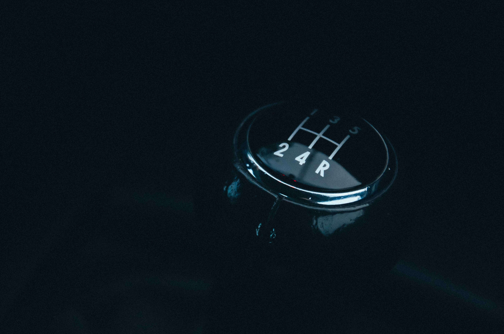
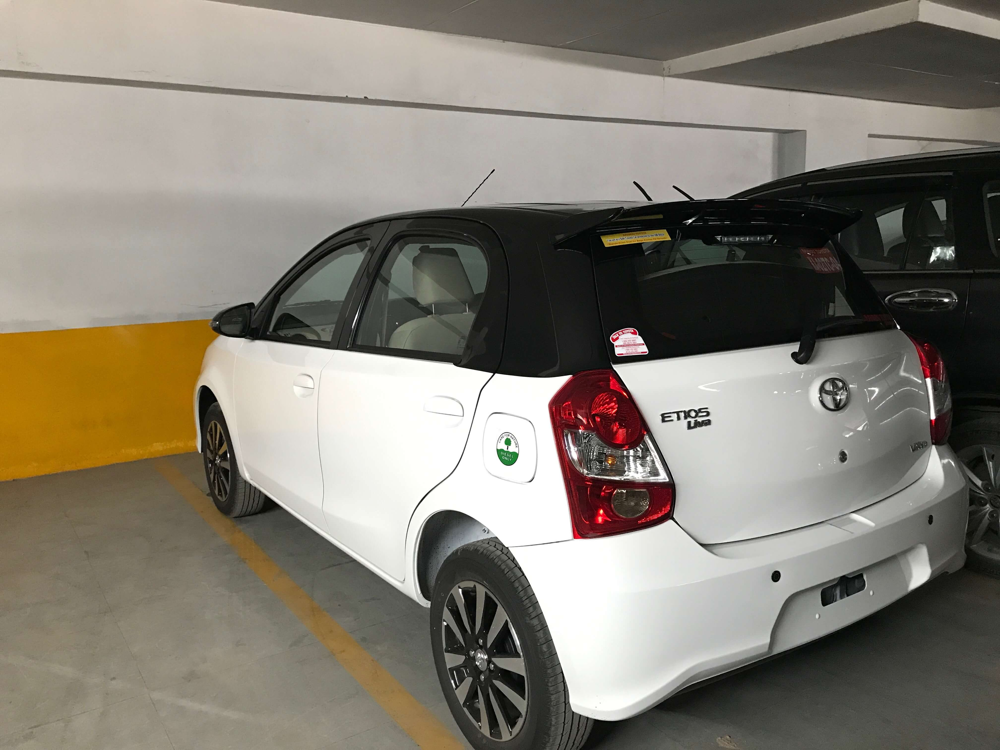
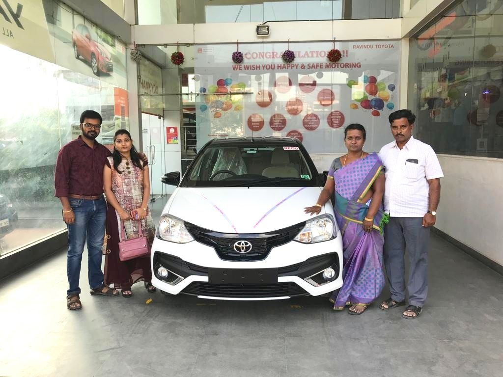

If you're a 90's kid then you would know what a luxury a car is back then. Owning such a luxury isn't quite easy.

In this post, I'll be sharing my car buying experience and along the way provide you with tips that could help you maximize the money you spend and also save your hard earned money on your first or next car like I did.

I taught myself to drive car during my school days. Owning a car became a fascination since then.
 However a decade had passed and the need for a car never arose until recent times. There were 
 times when I was desperate to drive and I quenched my desperation by making use of car renting 
 services like [Zoom Car](https://www.zoomcar.com/), [Revv](https://www.revv.co.in/), 
 [SelfRoadiez](https://www.selfroadiez.com/).
 

 
## The Decision
 
During one of such trips in October, my wife and I decided that we should be owning a car than renting it. We realized that renting cars on the basis our needs doesn't equate to a good value for our money and time.

## The Budget

There will always be a better car to buy. Trust me one of the most important things that you've to get it right at first is your "budget". Your budget should not only account for the Car's ex-showroom price but also for the additional costs such as Road tax, Registration and Insurance. Otherwise you would end up spending more than your planned budget.

## Pre-owned?

Earlier to October, I was on the look out for pre-owned cars as I know I would be wanting a car in the near future. I preferred pre-owned cars to keep a check on my budget.

After I inspected a few cars, I realized that not many people maintain the car that way it is supposed to be. Also, I found it to be very time consuming to find a car of my taste.

Unless you're well educated about the car market, you could easily be deceived on a lot of 
factors. TeamBHP has a good [guide](https://www.team-bhp.com/forum/buying-car/18859-article-how-buy-used-car-india.html) if you're looking to buy pre-owned cars.

## Hatchbacks, Sedans & Cross-overs

Cars are like mobile phones - there will be tons to choose from, and new models keep popping up every now and then. In my opinion, it is better to buy a car based on your needs and driving taste.

I was never a fan of [Crossovers](https://en.wikipedia.org/wiki/Crossover_(automobile)), so I crossed them right off the bat. Sedans are super sexy and 
I'm a big fan of 'em. I had couple of good cars in mind but they were slightly out of the budget that I originally planned (remember the budget rule?)

Well, hatchbacks then, isn't it? Alright. Some of the important factors in my consideration were the NCAP safety rating report, driving comfort, engine durability, good after sales service, practicality, availability of parts, reasonable mileage and the re-sale value.

With the above considerations, I had shortlisted three cars - [Nissan Micra](https://www.nissan
.in/vehicles/new/micra.html), [Toyota Etios Liva](http://toyotaetiosliva.in/dualtone/) and
 [Volkswagen Polo](https://www.volkswagen.co.in/en/models/polo.html). The ground clearance in Nissan Micra was a turn off for me. So I crossed it 
 off my list.
 
Etios Liva and Polo were a tie in terms of seating comfort and practicality. Polo definitely wins in terms of performance. However, Toyota’s D-4D engine on the Liva which is battle tested for years, made me lean towards it and cross-off the little monster, the Polo.
 
One of the often highlighted downsides with Etios Liva in comparison to the Polo is the body 
metal thickness. But after reading [this](https://www.team-bhp.com/forum/road-safety/155988-sheet-metal-thickness-does-matter-12.html) thread from TeamBHP, I felt that it was not too much of
 a concern.
 
 Test Drive
 I called up Toyota helpline and booked test drives with two of the dealers in Bangalore – [Nandi Toyota](http://www.nanditoyota.com/) and [Ravindu Toyota](http://www.ravindutoyota.net/). I scheduled one during day time and one during dusk. Though I had asked for the Diesel variant to test drive yet one of the dealers got me a Petrol variant. I got to drive both the variants and to be honest, I liked the Diesel variant more than the Petrol variant. Manoeuvring within the city was quite a breeze with Etios Liva.
 
Both the dealers were exceptionally good with customer service. I preferred Ravindu Toyota because the sales person was patient and was not very pushy.
 
## Numbers & Negotiation

After shortlisting and test driving the car, the next important phase is settling on the price. All I can say about this phase is “Ask and it shall be given to you”.
 
Not all months guarantee great discounts. But as per the Internet, the best time to negotiate and
 buy a car is during the months of March and October. In case you can’t wait for those months, 
 try closing the deal during month-ends. You might get lucky and get good discounts. Here is a 
 YouTube [video](https://www.youtube.com/watch?v=v8VYNFzmJIQ) that helped me to negotiate.
 
**Pro Tip**: If you want to get the best deal from the dealer, buy just the car and neither 
insurance nor opt for in-house finance.
 
Here are some of the additional ways you can save your hard earned money.
 
### Insurance
 
- Do not buy the insurance from the car dealer. You car dealer takes a cut from the Insurance 
company and this gets added to your premium in one way or the other.
- Learn the Insurance jargons like First Party, Second Party, Third Party, Zero Depreciation, IDV,
 etc. This will help you buy the right plan. *Never buy an insurance plan when you do not 
 understand the Policy wording*.
- Think about the potential risks covered under your Insurance policy. This helps you understand 
how much IDV should you opt for. In case you live in a flood-prone area or you think you are 
prone to any such risks covered under your policy then you could opt for higher IDV. Otherwise 
opt for lesser IDV and you can see the premium drop by few thousands. For example, an insurance 
plan with 85% of Ex-showroom price as IDV will save you ~ 11,000 INR more than a plan with 95% of Ex-showroom as IDV. Remember IDV comes only in to picture in case of [Total Loss](https://en.wikipedia.org/wiki/Total_loss) of the car.
- Since the Third Party insurance is [mandated](https://economictimes.indiatimes.com/industry/banking/finance/insure/irdai-makes-long-term-3rd-party-insurance-must-car-bike-purchase-to-cost-more-from-sep-1/articleshow/65612881.cmshttps://economictimes.indiatimes.com/industry/banking/finance/insure/irdai-makes-long-term-3rd-party-insurance-must-car-bike-purchase-to-cost-more-from-sep-1/articleshow/65612881.cms) since September 1, 2018, opt for longer term i.e. 
First + Third party for *3 years*. This will get you a discount on the premium.
- Depending on your Car’s security features like Central locking system, Airbags, etc., your 
Insurance company might get you a discount on the premium. Do not forget to check these discounts.
- You can also save on tons of other options if you read the Policy’s terms and conditions before 
buying the insurance.
- Educate yourself on how to reach out to the Insurance company and make few calls to check their 
responsiveness. Not only saving money should be the intention but also to get the maximum value out of it.
- Once you buy the insurance, make sure to verify all the information in the Policy is 100% 
correct. Don’t give the Insurance company a chance to deny your claim.

### Financing
 
- Most Car dealers offer financing options. In case you’re opting through the Car dealer, be sure 
to inquire on other deals such as the bank with which you own an account, etc.
- Limit your loan tenure to any where between 24 and 48 months. The longer your tenure, the more 
interest you pay.
- In my opinion, if you cannot repay the loan within 48 months, then the Car is well beyond your 
budget.
- Before you opt for the loan be sure of the loan type – fixed or floating. [Learn more](http://www.rediff.com/money/2007/oct/08loan1.htm) about 
Fixed vs Floating rate car loans. Unless you know what you’re doing, a *fixed rate* loan would benefit 
 you.

### Complimentary
 
 Make sure to talk to your dealer on the complimentary stuffs that would be provided. Negotiate and opt for useful complimentary stuffs like Floor mats, Mud flaps, Microfiber cloth for cleaning the car, L board decals, etc. and avoid almost useless synthetic car perfumes.
 
### Downpayment
Right after you negotiate and arrive at a price, the dealer would force you to make the downpayment by saying that the discounted price stands only for you and only for a limited time. Do not fall prey in to the trap. Be polite and thank them for their time and let them know you would come back to book the car if the deal seems right.
 
Go home and take your time. Negotiate with other dealers and let them to compete against their prices and come back to you with their best possible quotation. The lowest quoted car dealer may not always be the best in terms of hospitality and professionalism. I would be willing to spend a little more on the dealer who treats me with respect and takes utmost care even on the slightest of the things.
 
Once you’re sure on the deal that works for you, go ahead! You’ve scored a sweet deal by now. Do not turn back and wait for more. Treat the sales person like the way you want to be treated. Build a rapport with him and his manager. This will help you have a good relationship in the long run.
 
## Pre Delivery Inspection
TeamBHP has a valuable [thread](https://www.team-bhp
.com/forum/buying-car/68581-article-pre-delivery-inspection-pdi-check-list.html) on the 
pre-delivery inspection that you should perform before your car registration. I strongly 
recommend that you read through. Here is another [thread](https://www.team-bhp.com/advice/find-your-cars-date-manufacture-vin) that helps you infer the Car 
manufacturing date from the Chasis (a.k.a VIN) number. By learning to decode your VIN (Vehicle Identification Number) you can be sure that you are not sold an old car.
 

 
In addition to TeamBHP’s thread, I would like to add the following points.
 
- If you like your dealer to arrange for any rituals for your new car, inform the dealer prior to 
your delivery date.
- Schedule your delivery and get your car out of the Dealer’s garage as soon as the registration 
is complete.

## Delivery
If you’ve read TeamBHP’s thread, you would know by now that the delivery day is a happy day not only for you and your family but also for the dealer as well. I personally presented a gift to my Salesperson as a token of appreciation and the professionalism he portrayed throughout.

Also, my wife and I made sure that we received everything as mentioned in the TeamBHP’s delivery checklist. We got the date and time of delivery scheduled and the car was delivered as requested. After years of fascination, prayers and hard work here is our new car.

My grandfather is my great inspiration but he is no more now. But I know he would be watching and blessing us. Had he been with us, he would have put a large smile on our face.
 
**Fun fact**: I started writing this post a day or two before the date of delivery of our car. Eight weeks have passed since then and now my odo reads 3400 Kms and I got the first service even done at 962 Kms.