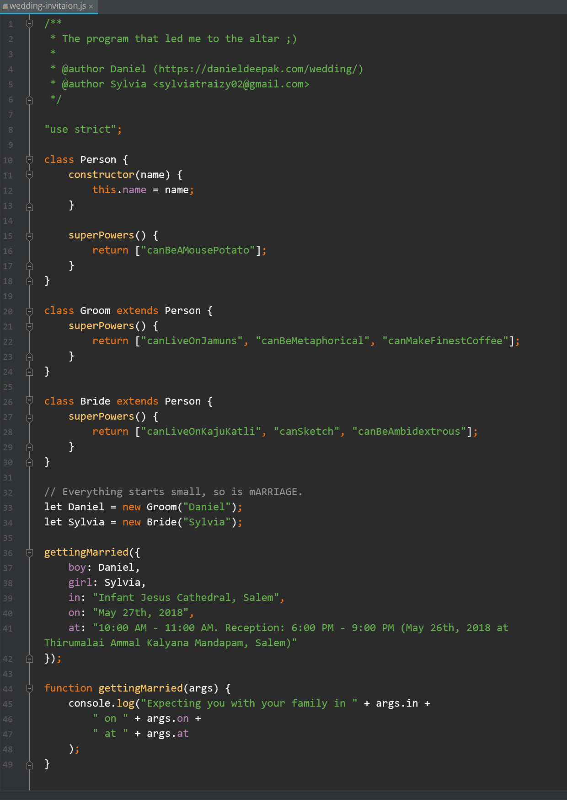

> I have found the one whom my soul loves. - Song of Solomon 3:4

So, I decided to marry her.

When it comes to Wedding, one of the key things is the Wedding Invitation. My fiancée and I wanted to get a card of our choice printed to invite our friends and colleagues.

## Personality

My fiancée wanted to get a card that looked unique and fancy. However, I wanted to showcase our personalities in the card. She didn't give a thumbs up to my idea, initially. If you know me well, you would know that I'm always ready to take 'No' for an answer, but I wouldn't give up easily. Needless to say, when I came up with an initial draft, she loved the idea and ended up giving a Hi5.

## Explanation

One of the compelling reasons to use Javascript in the Invitation is because my next venture is more oriented towards Javascript & ReactJS.

I nicknamed this Invitation program as "[The Program that led me to the altar](https://en.oxforddictionaries.com/definition/lead_someone_to_the_altar)" (Naming and 
comments are really important when it comes to Programming 😉).

The Program starts with a Person class with a superPowers() method, that states the super powers 
of a person. ([Mouse Potato?](https://www.google.co.in/search?q=mouse+potato))

Next, as you can see there are two classes `Groom` and `Bride` that extends the `Person` class, with their own `superPowers()`, indicating a bit of our personalities. Who knows, we may use our `superPowers()` to hold on to each other, during our ebb and flow.

Object instantiations (`Daniel` and `Sylvia`) are personalized Class instances.

`gettingMarried()` is the actual function that prints the Wedding information.

## Credits & Inspiration

Being an open source lover, I want to credit the source of inspiration for our Wedding card. When
 I came across [Sudar's Wedding invitation](https://github.com/sudar/wedding-invitation), it blew my mind and I was wanting a card like his.

His geekiness peaked when he licensed his Invitation as [Beerware](https://en.wikipedia.org/wiki/Beerware). And yeah, you guessed it right
 - I'm gonna buy him a beer.